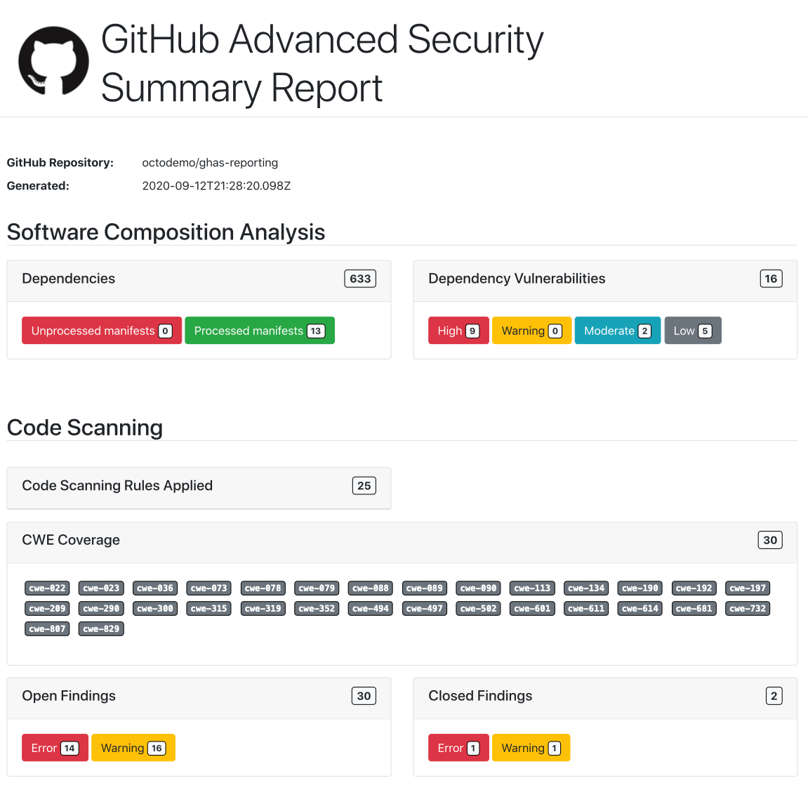

# security-report-action

> [!CAUTION]
> This is early access code and is not ready for production use! There will not be a release of this to the GitHub Actions Marketplace until the `v1.0.0` version. The `main` branch is where active changes are being made and should be considered a moving target until `v1.0.0`.


A GitHub Action for generating PDF reports for GitHub Advanced Security Code Scanning, Secret Scanning and Software Composition Analysis.

The action comes with some predefined HTML templates using [Nunjucks](https://mozilla.github.io/nunjucks/templating.html),
along with the ability to in the future provide your own templates to the renderer.

## Background

This codebase started out as a fork of https://github.com/peter-murray/github-security-report-action and has since diverged, this is the repository where all new features will be delivered.

The active development focus is to provide an updated reporting action that can be evaluated and tested within customer use cases and to build out the various report templates to cover a number of reporting scenarios.

Until the project reaches a `1.0.0` state, it will not be supporting contributions via Pull Requests, at which time it will support "normal" Open Source contributions as detailed in the [CONTRIBUTING.md](CONTRIBUTING.md).


## Processing

The action will use the provided token to load all the dependencies, dependency vulnerabilities and the Code Scanning results for the specified repository. It will then look in the directory specified for any SARIF reports.

With this data it will construct a JSON payload that it then passes into the template system (using Nunjucks a Jinja like templating system for JavaScript) and will generate a Summary Report (with more of these to come in the future) providing a roll up summary security report in HTML.

Using this HTML, it then passes it over to Puppeteer to render this in a headless Chromium before generating a PDF and saving it in the specified directory.


## Parameters

* `token`: A GitHub Personal Access Token with access to `repo` scope and `security_events`
* `outputDir`: The output directory for the PDF reports, defaults to `github.workspace`
* `repository`: The repository in `<owner>/<repo_name>` form, defaults to `github.repository`
* `ref`: The repository branch reference in `ref/heads/main` or for branches short name format e.g. `main`
* `sha`: The sha of the HEAD of the `ref` to fetch the code scanning results for
* `sarif_report_id`: An optional id of the SARIF report upload that you want to use for the latest analysis that the report is based off
* `report_template`: An optional template for the report that you want to generate
* `include_code_scanning`: An optional flag to disable code scanning lookups, maybe if you report template does not require them. Defaults to `true`
* `include_secret_scanning`: An optional flag to disable secret scanning lookups, maybe if you report template does not require them. Defaults to `true`
* `include_software_composition_analysis`: An optional flag to disable SCA related lookups, maybe if you report template does not require them. Defaults to `true`


## Templates

Currently the templates are hard coded into the action. There are extension points built into the action that will allow
a future release to provide customization of these templates, via an ability to specify your own.


## Examples

Using the main branch whilst under development:
```
name: Generate Security Report
uses: advanced-security/security-report-action@main
with:
  token: ${{ secrets.SECURITY_TOKEN }}
```

Example summary report output:



## License
This project is licensed under the terms of the MIT open source license, Please refer to [LICENSE](LICENSE) for the full terms.


## Acknowledgements
The original code base was based off the original https://github.com/peter-murray/github-security-report-action.
